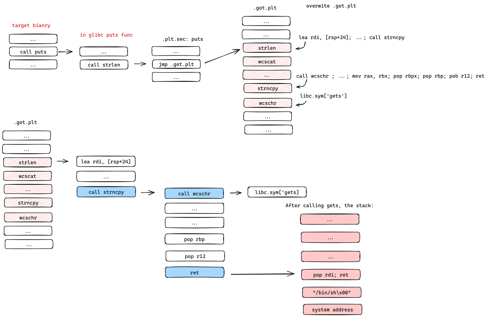

# Libc-GOT-Hijacking (only works for glibc < 2.39)

Transform arbitrary write to RCE.

This is a userspace attacking skill: If you can write arbitrary memory space, you can use this method to execute arbitrary code. 

> You only need to know the base address of Glibc
> Glibc is FULL RELRO by default for glibc2.39. A great security improvement! We can't hijack Libc GOT on libc version >= 2.39

## glibc > 2.35 & glibc <=2.38

Compared to glibc<=2.35 there is mitigation implemented, which forbids the methods for the old library. However, we designed a method to bypass it and execute arbitrary code by 
once arbitrary write on Glibc's GOT table. This method performs Return Oriented Programming (ROP) attack on the Global Offset Table (GOT). 

You can find details, templates, demos, and everything you want in: [Details][0] and [Templates][3]

## glibc <= 2.35

I learned the original method from [Sammy Hajhamid][2] also the methods for glibc <=2.35 are inspired by his work.

Based on his work, We designed a method to execute arbitrary code by once arbitrary write on Glibc's GOT table. The method uses `PLT_0` to push `libc_exe_address` to the stack and then use `POP RSP, RET` to execute our `ROPchain`.

You can find details, templates, demos, and everything you want in: [Details][1] and [Templates][4]

# Acknowledgments

- Great job [@swing][5] on the impressive work with glibc >2.35!

- Appreciate the original work done by @pepsipu.

# Reference link
- [@pepsipu's Method][2]

# Todo
- Provide the one\_gadget version
    - Only modify 0x10 bytes (gadget1 + one_gadget)
- Fix it for the latest Glibc

[0]: ./Post/README.md
[1]: ./Pre/README.md
[2]: https://hackmd.io/@pepsipu/SyqPbk94a
[3]: ./Post/one_punch.py
[4]: ./Pre/templates.md
[5]: https://bestwing.me/
